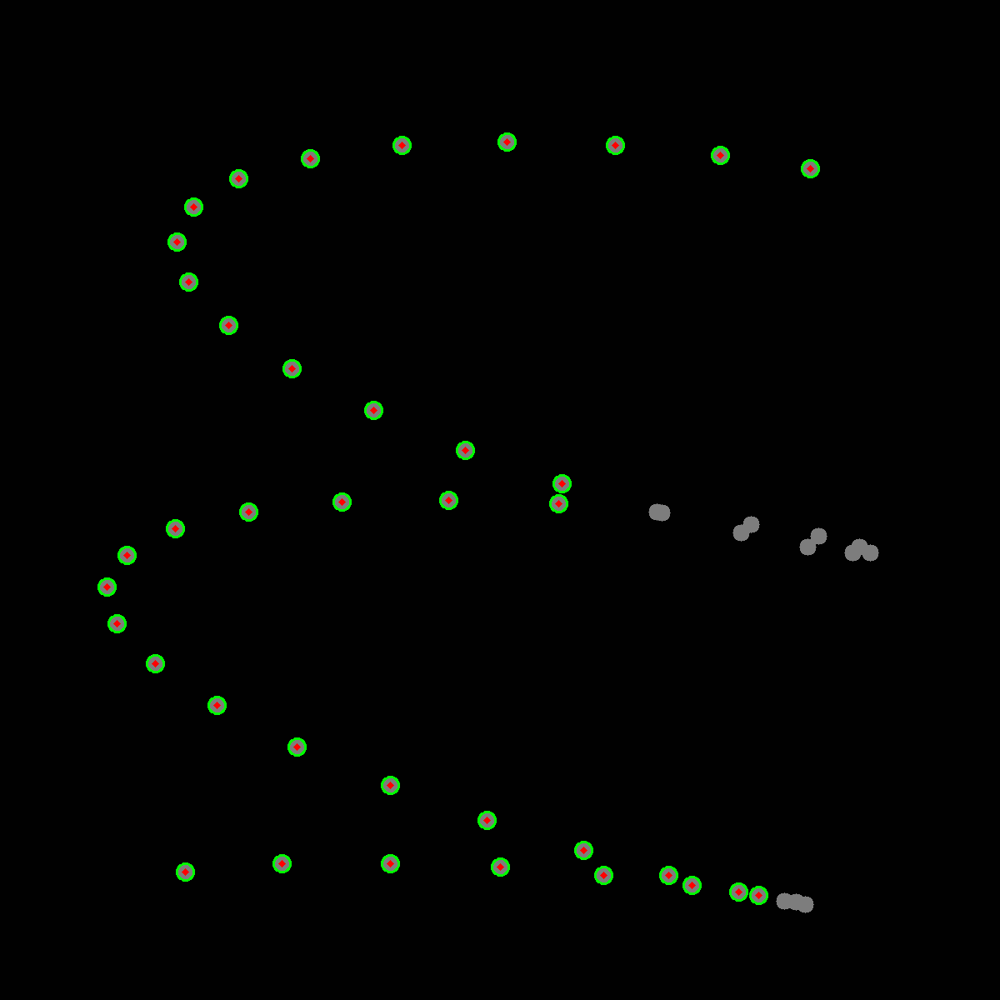
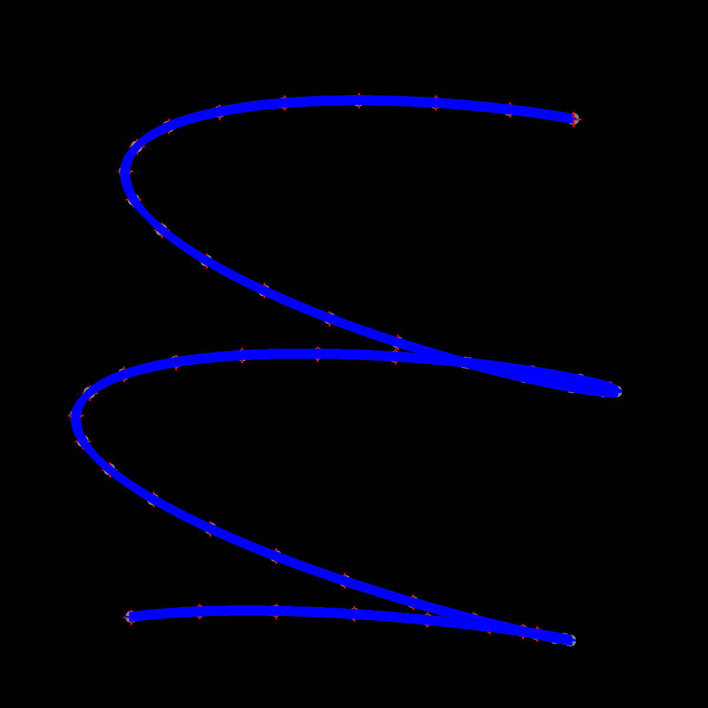

# geometric-calibration-with-helix

This repository is a standalone python package that demonstrates a 3D geometric calibration framework with a 3D helix.

It comes with the following functionality:
- optimal parameters for a parametric curve that represents a helix
- the definition of spheres with a certain diameter that are sampled and placed on the helix
- a *projector* that generates 2D detector images of the given 3D helix
- a *segmentation* module that detects the circles on the generated images based on the given sphere diameter
- a *calibrator* module that creates a densely sampled 3D helix structure which will be compared to the detected circles in the next step
- an *optimizer* that performs non-linear optimization on a cost function in order to minimize the geometric error of the provided rotation and translation parameters of the helix

